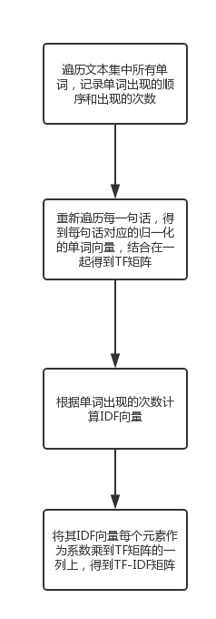
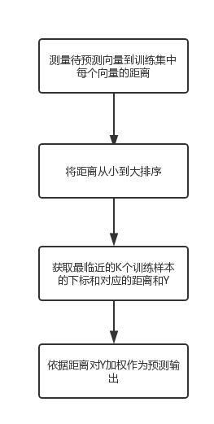
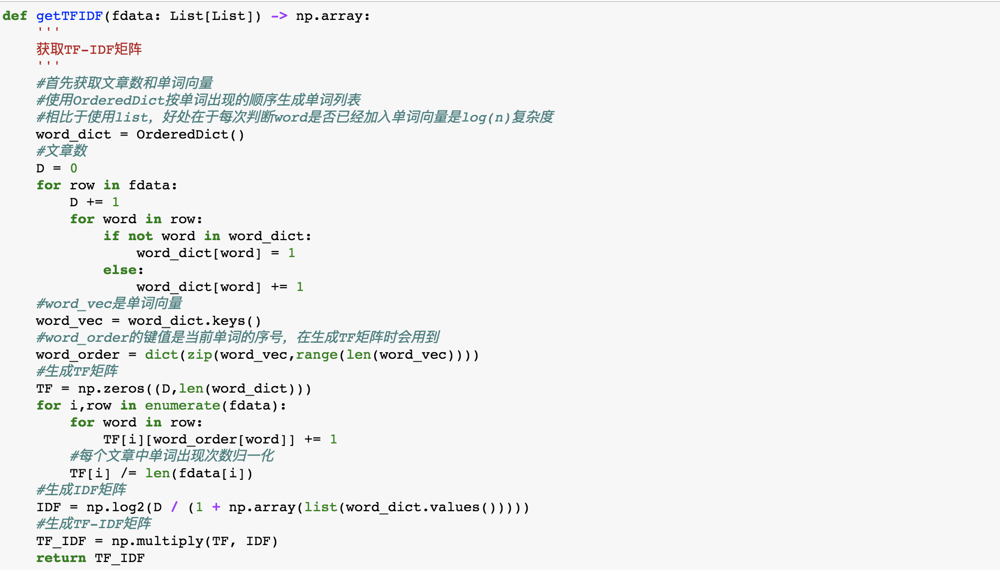
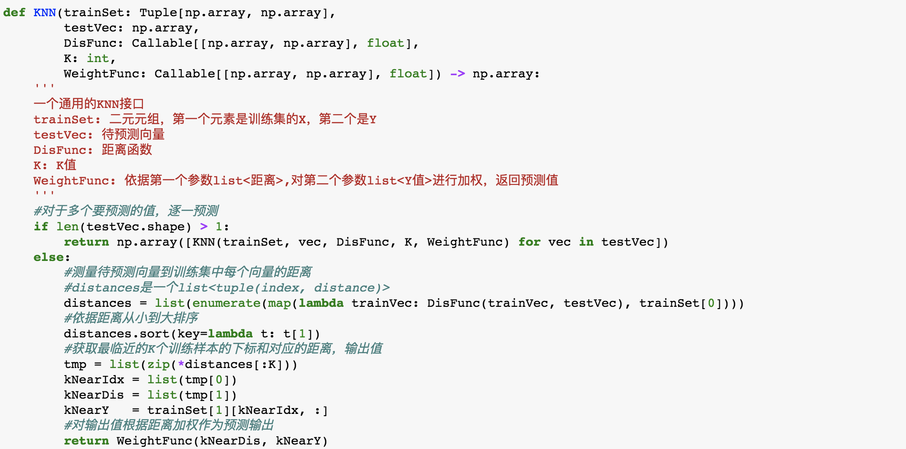
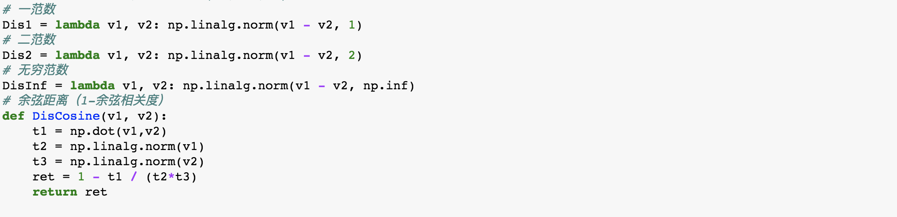
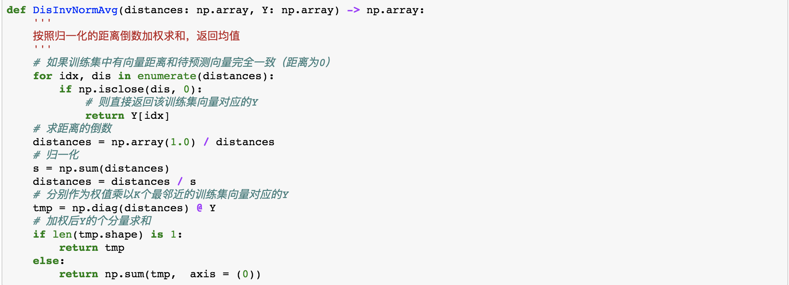
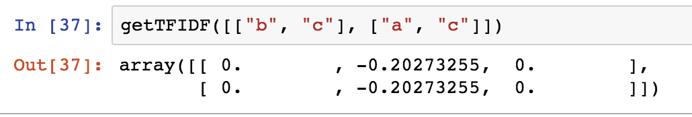
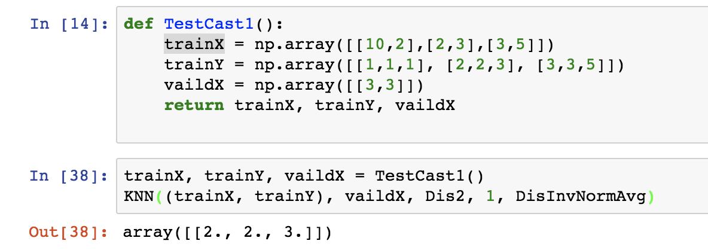
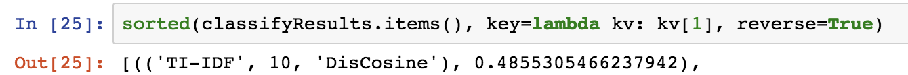
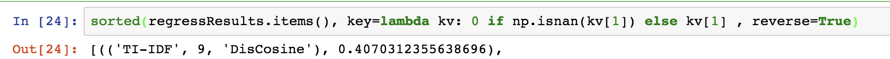

# 中山大学数据科学与计算机学院

# 计算机科学与技术专业-人工智能

# 本科生实验报告

# (2018-2019学年秋季学期)

课程名称：  **Artificial Intelligence** 

| 教学班级 | 计科2班  | 专业（方向） | 计算机科学与技术 |
| -------- | -------- | ------------ | ---------------- |
| 学号     | 15323032 | 姓名         | 李新锐           |

## 实验题目

⽂本数据集简单处理 &KNN 

## 实验内容

### 一、算法原理

本实验中，我们学习了基于TF-IDF算法的文本数据集处理及KNN算法的原理与实现。

TF-IDF算法的输入是一个文章集合，每篇文章由单词组成，因此可视为一个二维矩阵。输出是文章集合中每一个单词的重要程度的一维向量。

该算法基于一个对单词重要程度的假设：越重要的单词应当在某篇文章中出现次数很多，但在文章集中出现的频率却是较低的。举例而言，我们现在假如以一部人工智能算法论文集作为训练集合，要求求出每个单词的重要性。在一篇有关KNN算法的论文中，“KNN”一词可能反复出现，同时在其他论文中可能几乎不出现。因此被看作有很高的重要性。反之，单词“to”在一篇文章中虽然出现次数很多，但由于它几乎是在每篇文章中出现，因此给予TF-IDF算法，其重要性几乎为0。可见，该算法是较为符合实际情况的。

KNN算法的是一种监督学习方法，它的基本原理是：对于要预测的**输入X**，他依据给定的**距离测度**，在训练集中找到**最临近的K个**向量，将这K个向量的Y依据距离进行**加权**，作为最终预测的输出。

直观地，我们可以理解KNN是一种“找原题”算法，他仅仅是从已知的数据集中寻找最相似的，把它们的答案加权综合起来作为新题的答案，而不进行其他的规律总结。

## 二、伪代码

下面的伪代码展示了执行一次回归问题求解的基本框架（分类问题与之类似）

```python
# 步骤一：从文件读取输入
trainX_data, trainY_data = ReadFileFunc(train_filen) #读取训练集X，训练集Y
vaildX_data, vaildY_data = ReadFileFunc(vaild_filen) #读取验证集X，验证集Y
# 步骤二：将输入向量化
trainX, trainY = vectorizeData(trainX_data, trainY_data)
vaildX, vaildY = vectorizeData(vaildX_data, vaildY_data)
# 步骤三：执行KNN函数，得到预测的Y
predictY = knnFunc(trainX, trainY, vaildX)
# 步骤四：将预测的Y与验证集的Y作对比得到回归相关度
print("Correlation Coefficient: ", pearsonr(predictY, vaildY)
```

由于Python代码已经很类似伪代码，因此下面以流程图的方式展示TF-IDF及KNN算法的原理，关键代码在下一节展示。

1. TF-IDF流程图




2. KNN算法流程图

   

## 三、关键代码截图（带注释）

1. 获取TF-IDF矩阵



2. KNN主函数，它是一个高阶函数，距离测度和加权函数均是在外部实现，并传入其中的，因此可以很方便地尝试各种求距离和加权的方法。



3. 四组距离测度函数



4. 对K个最邻近的结果加权求和的函数



## 四、创新点&优化

1. 在处理TF-IDF矩阵时引入了特殊的nan单词，代表训练集中没有而出现在预测集中的单词。避免了一个所有单词均不在训练集中的要预测的向量。
2. 使用函数式编程，实现了全自动调参框架autoTrain，接收不同的距离测度等参数作为输入，自动测量最好的参数组合
3. 使用map、filter、list comprehension等抽象程度更高的函数以及numpy自带矩阵运算替代低效的for循环，代码简洁，程序执行速度较快

## 五、实验结果展示

TF-IDF:



KNN:



## 六、**评测指标展示即分析**

分类：使用TF-IDF，K为10，使用余弦距离时有最佳分类结果，准确度为0.48



回归：使用TF-IDF，K为9，使用余弦距离时有最佳回归结果，相关度为0.40



## 七、思考题

1. IDF的第二个计算公式当中出现的分母多了1是什么意思？

   答：避免当一个单词在每一篇文章中均不出现（测试集数据可能出现这种情况）时分母为0导致运算异常

2.	IDF数值有什么意义？TF_IDF数值有什么含义？

   IDF数值表示某个词在文章集合中的出现的稀有度，这个值越大，代表有它出现的文章越少。TF_IDF数值代表一个单词在整个文本集中的重要程度。

3.	（距离作为权重）为什么是倒数呢？

   越近的向量的权重应当越大，取倒数能表示这一关系。