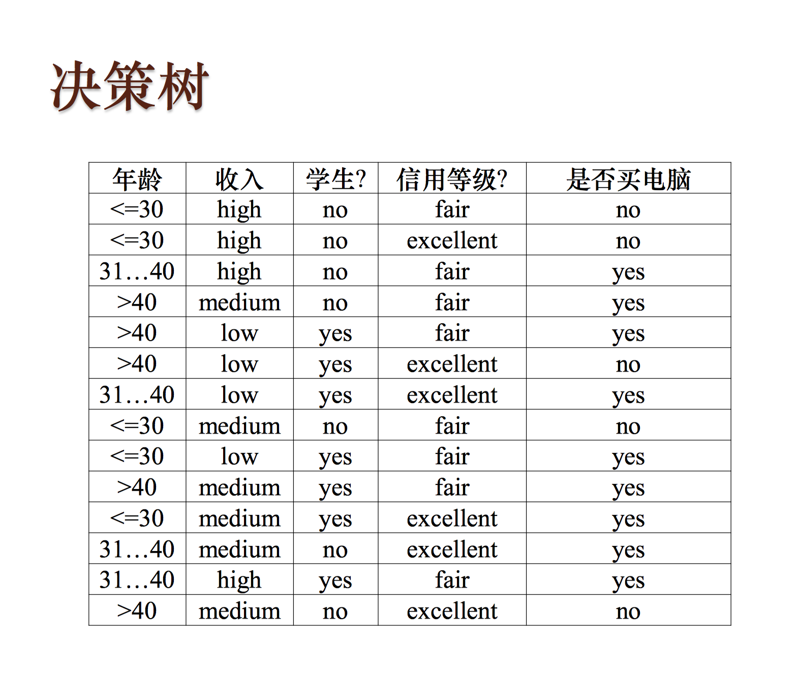
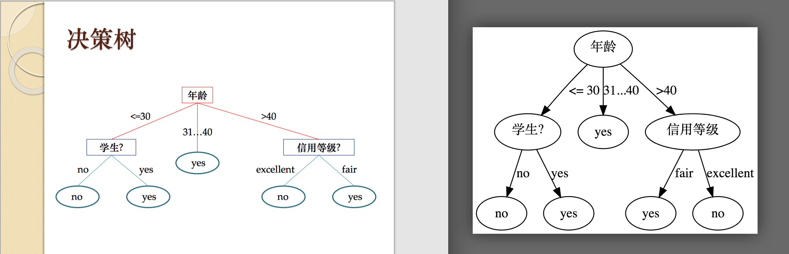
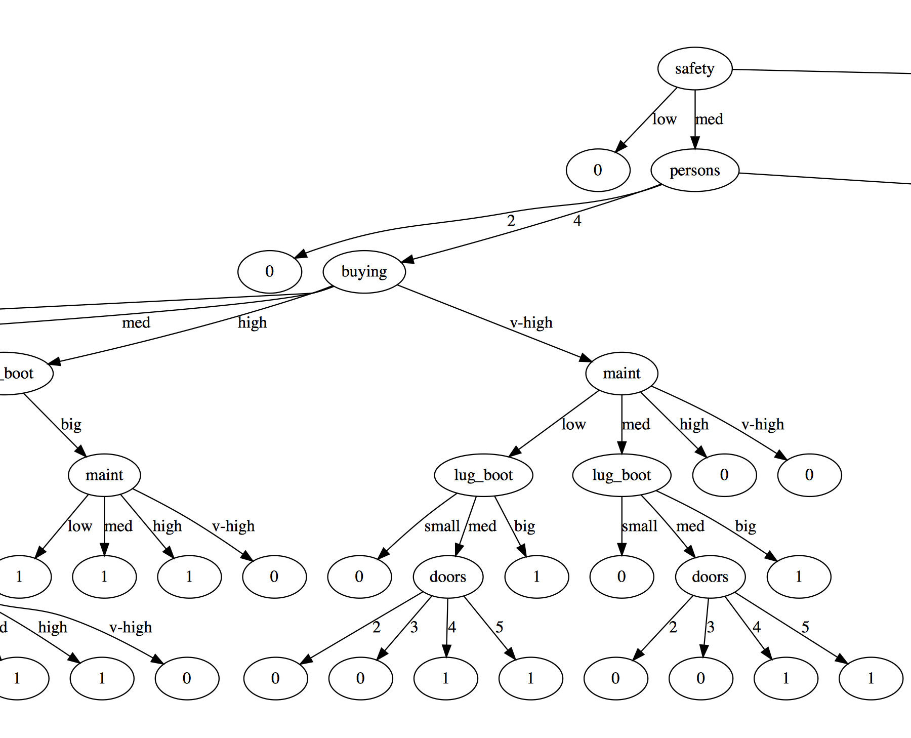
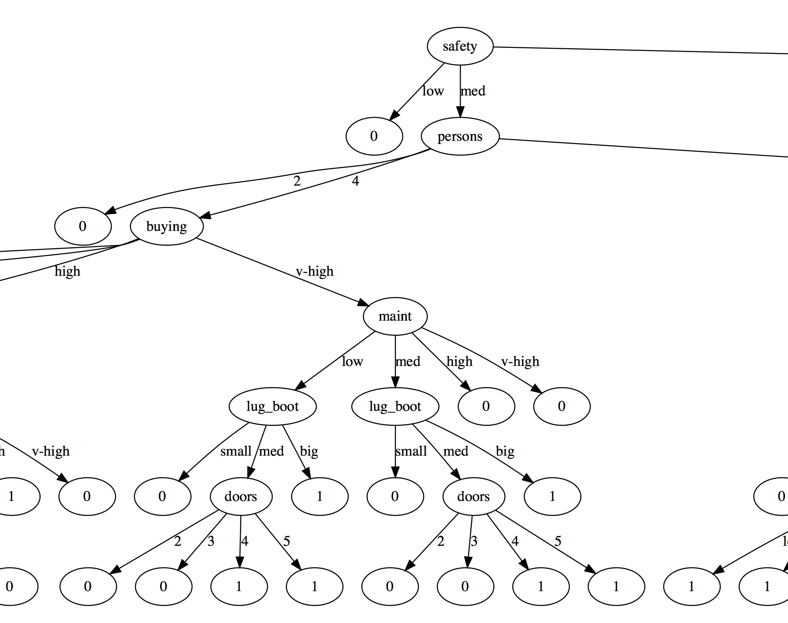

## 一、实验题目

决策树

## 二、实验内容

### （一）、算法原理

决策树是一种树形

### （二）、伪代码

####1. 建树过程：该过程是一个递归过程，伪代码如下： 

```python
# 依据训练样本集D和特征集A训练决策树
# judge_func是一个函数参数，它的不同决定了决策树是ID3/C45还是CART
train(D, A, judge_func):
    # 训练集D的X，Y分开
    (X, Y) = D
	# 记mode为当前节点数据集的结果的众数
	mode = sum(Y) > len(Y) / 2
	'''
	结束条件有4种，分别是：
		1.训练集为空
		2.特征集为空
		3.所有训练数据特征均一致
		4.所有训练数据分类一致
	'''
	if empty(D) or empty(A) or all_equal(X) or all_equal(Y):
	    # 设置当前节点为叶节点，结果为mode
		node.isLeaf = True
		node.Y = mode
		return node
    # 对于每一种特征计算信息增益或基尼系数的减少值
    info_gain = [judge_func(D, a) for a in A]
	# a* 是信息增益最大的一组特征
    a* = indexof(A, max(info_gain))
    # 在特征空间中移除a*
    erase(A, a*)
    # 对于a*的每个取值
    for i in featureValues[a*]:
        # 取对应属性相同的子训练集
        S = subset(D, a*)
        # 递归训练并添加到子节点集中
        node.child.append(train(S, A))
```

#### 2. 计算信息增益或基尼系数的减少量的函数

首先定义计算概率为$p$的二项分布的熵函数和基尼系数函数

```python
H(p): - p * log(p) - (1-p) * log(1-p)
gini(p): 2 * p * (1-p)
```

ID3，C45，CART的有关信息增益或基尼系数的减少值的计算过程基本相同，可以抽象出一个judge_func_base函数

```python
judge_func_base(D, a, Fun):
	(X, Y) = D
    # 由于Y的取值仅为0或1，故sum(Y)即是Y中1的个数
	p = sum(Y) / len(Y)
    # 依据特征划分前的熵
	H_D = H(p)
    # 依据条件a划分条件熵
	H_D_When_a = 0
    # 依照公式，对a的每种取值算出p * Fun(p)求和
	for i in a:
		(SX, SY) = subset(D, i)
         p = len(SY) / sum(SY)
         H_D_When_a+= p * Fun(p)
    return H_D - H_D_When_a  
```

基于它们可以分别定义ID3, C45, CART为

```python
ID3(D, a): judge_func_base(D, a, H)
C45(D, a): judge_func_base(D, a, H) / split_info(D, a)
CART(D, a): judge_func_base(D, a, gini)
```

其中`split_info(D, a)`定义为

```python
# 依照公式求和
split_info(D, a):
	for i in a:
        (SX, SY) = subset(D, i)
        p = len(SX) / len(D)
        SplitInfo += - p * log(p)
```

#### 3. 预测函数

在建好树后即可对新的数据进行预测，预测代码很简单：

```python
predict(x):
	# 从根节点开始遍历
	head = root
    # 如果没有遍历到叶节点就一直遍历
	while head is not leaf:
         # 取当X的用于划分当前节点的特征的值
		c = X[head.a]
         # 依据该值选择子节点
         head = head.child[c]
     # 返回叶子节点的值
     return head.y
```

### （三）、关键代码截图（带注释）

#### 1.建树函数 ：

实际代码是用C++编写，和上述伪代码逻辑是基本一致的，区别在于对D为空的判断放在递归步判断，这样可以节省一次不必要的递归。决策树相关函数实现在DecisionTree类中。

```c++
/*
* 对应伪代码中的train函数
* Node为节点类型
* judge_func是一个函数参数，它的不同决定了决策树是ID3/C45还是CART
*/
void DecisionTree::train_worker(DecisionTree::Node *node, const JudgeFunc_t &judgeFunc)
{
    //获取该节点全部数据集的Y值
    auto D_Y = node->D.row(-1);
    //计算众数
    auto mode = (double)D_Y.sum() >= (node->D.cols() / 2.0);
    //若A为空集
    if(node->A.empty())
    {
        node->isLeaf = true;
        node->Y = mode;
        return;
    }
    //若D中全部样本属于同一类型
    if(all_equal(D_Y))
    {
        node->isLeaf = true;
        node->Y = D_Y[0];
        return;
    }
    //若所有样本各个属性值均相同
    bool flag = true;
    for(Index i = 0; i < node->D.rows() - 1; ++i)
    {
        if(!all_equal(node->D.row(i)))
        {
            flag = false;
            break;
        }
    }
    if(flag)
    {
        node->isLeaf = true;
        node->Y = mode;
        return;
    }
    //对于每一种特征计算信息增益或基尼系数的减少值
    Vec<double> info_gain;
    for(auto i: node->A)
        info_gain.push_back(judgeFunc(node->D, i, featureValues[i]));
    //a_star是信息增益最大的一组特征
    auto a_star = node->A[max_element(info_gain) - std::begin(info_gain)];
    node->C = a_star;
    //依据该组特征值划分数据集
    Vec<Vec<Index>> S(featureValues[a_star]);
    for(int i = 0; i < node->D.cols(); ++i)
    {
        S[node->D(a_star, i)].push_back(i);
    }
    //在特征空间中移除a_star
    node->A.erase(ranges::v3::find(node->A, a_star));
    //对于a_star的每个取值
    for(int i = 0; i < featureValues[a_star]; ++i)
    {
        // 取对应属性值相同的子训练集
        auto n = new Node(matrix_view<int>(node->D, S[i]), node->A);
        // 若子训练集为空，则将这个子节点标为叶节点，无需递归下去
        if(S[i].empty())
        {
            n->isLeaf = true;
            n->Y = mode;
            node->child.push_back(n);
        }
        else
        {
            //递归训练并添加到子节点集中
            train_worker(n, judgeFunc);
            node->child.push_back(n);
        }
    }
}
```

####由于计算信息增益或基尼系数的减少量的函数是简单的公式翻译的产物，和伪代码更没什么大区别，这里就不展示了

### 四、创新点&优化

一、由于决策树构建过程中经常要用取子数据集的操作，因此我实现了一个matrix_view（矩阵视图）类。它接收一个矩阵（代码中使用Eigen3矩阵）或一个父视图，和一个包含子数据集数据编号set，生成表示子数据集的视图。它仅储存编号而不需要拷贝矩阵的内容，从而提高了训练速度。同时在输入向量维度为$n$时，能够降低近$\frac{n-1}{n}$的内存使用量。

### 五、实验结果展示

#### 1.使用理论课课件的小数据集测试

理论课课件中提供了一个关于是否购买电脑的小数据集的ID3决策树样例（如下图）：



我使用graphviz库实现了生成的决策树的可视化，将我使用ID3算法得到的结果（下图右边）与理论课课件的结果（左图）比较，发现是完全一致的，初步验证了结果的正确性。


### 2. 训练集测试

以完整的训练集作为输入，我分别测试了ID3，C45，CART三种算法，生成的完整树很宽，因此保存为了PDF文件。这里仅展示部分效果

#### ID3:



#### C45:


#### CART:


可以观察到，三种算法生成的树结果基本是相同的，事实上，ID3与C45的结果中仅有3个节点是不同的，而ID3与CART的结果是完全一致的。

## 六、评测指标展示即分析

我使用了K交叉验证方法，遍历了K从5到16的情况。验证用代码如下（C++，range函数封装了range-v3库提供的view::ints函数实现）

```c++
//读取训练集数据
auto f = readFile("data/Car_train.csv");
//向量化
auto data = vectorizeData(f, mp);
//K遍历5到16的值
for(double K: range(5, 17))
{
    //N是总输入数据数
    int  N = data.cols();
    int  pieceSize = N / K;
    auto all = range(0, N);
    for(auto i : range(0, K))
    {
        //分割验证集 1/K 的数据作为验证集
        auto vaildSetRange = range(i * pieceSize, (i + 1) * pieceSize);
        matrix_view<int> vaildSet(data, vaildSetRange);
        //其余数据作为训练集
        auto trainSetRange = view::set_difference(all, vaildSetRange);
        matrix_view<int> trainSet(data, trainSetRange);
        //遍历三种决策树方法
        for(auto& [name, Func] : JudgeFuncs)
        {
            //各个特征的取值可能数
            auto featureValRanges = {4,4,4,3,3,3};
            DecisionTree t(trainSet, featureValRanges);
            //计时并建树
            auto start = now();
            t.train(Func);
            auto diff = now() - start;
            //验证并打印结果
            auto acc = t.vaild(vaildSet);
            print_ret(K, name, diff, acc);
        }
    }
}
```

验证结果如下：

