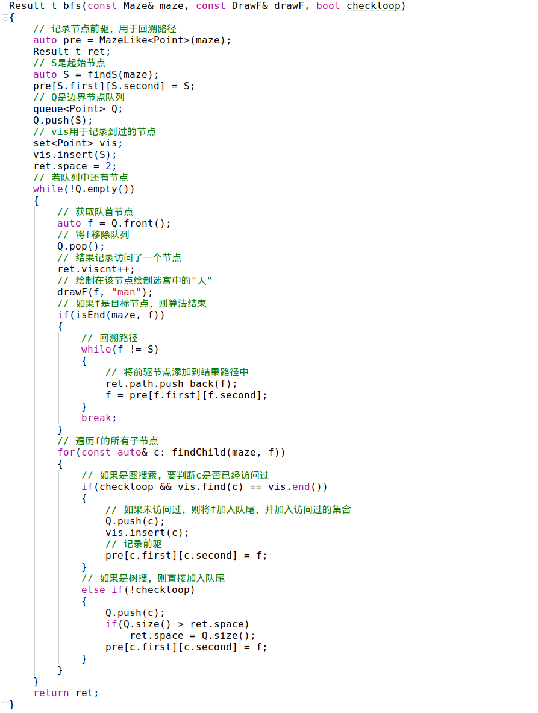
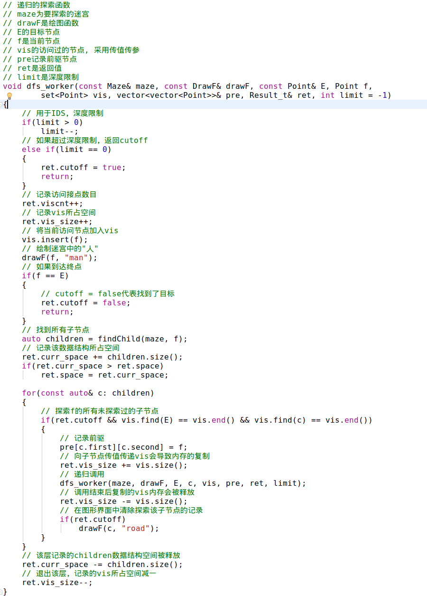
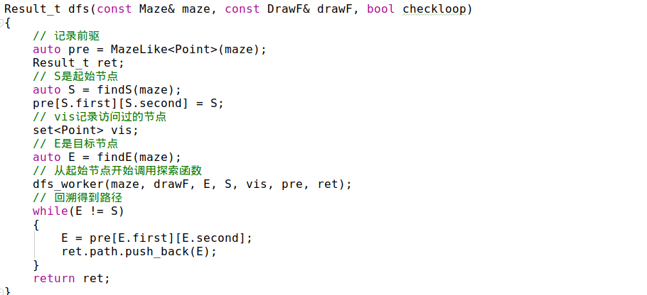
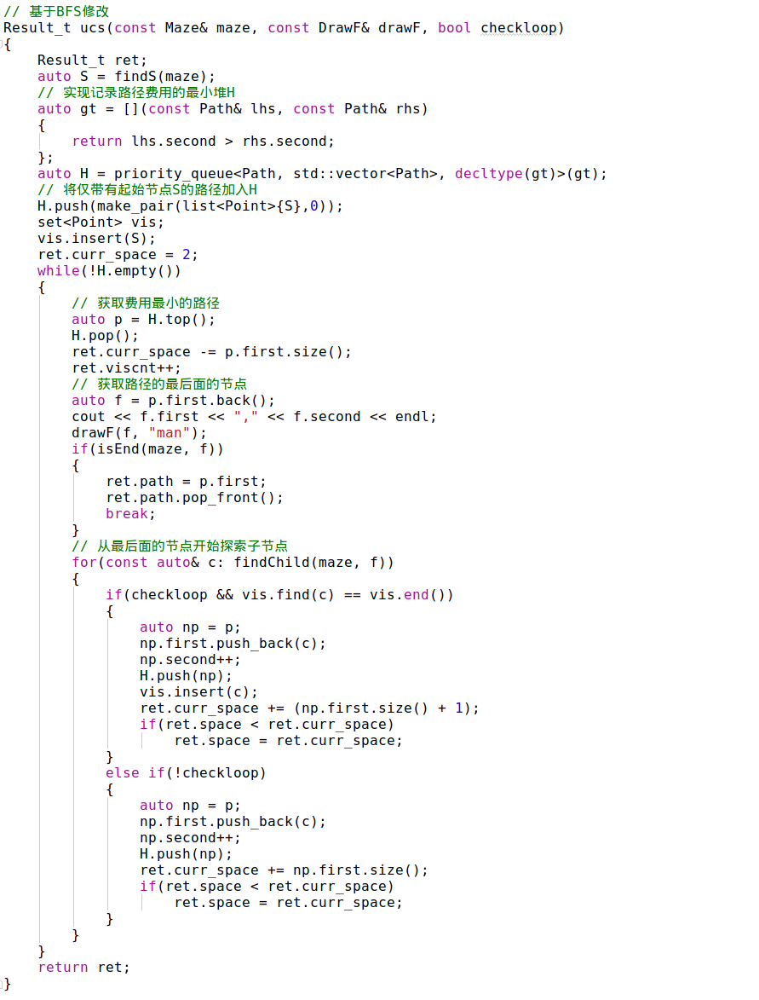
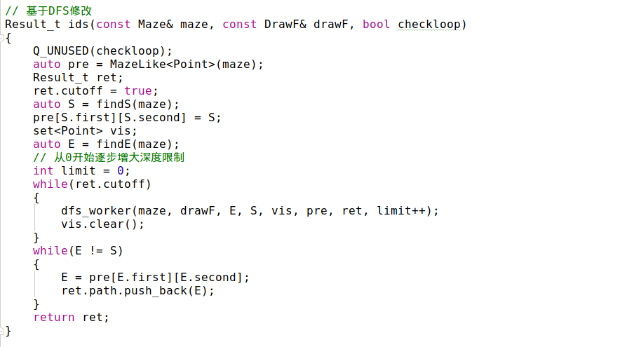
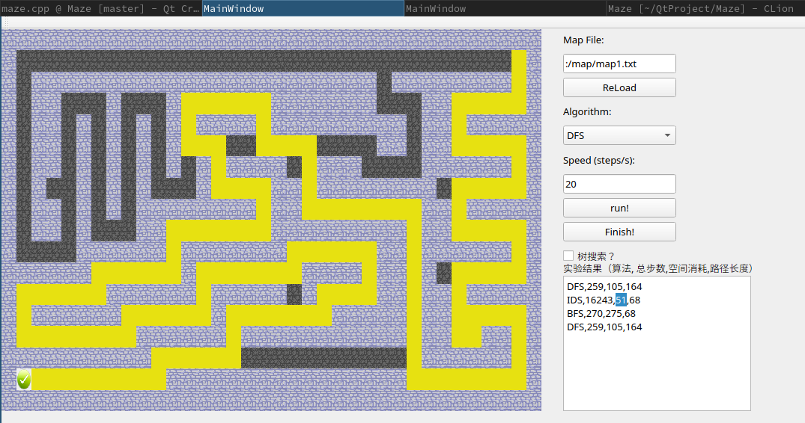
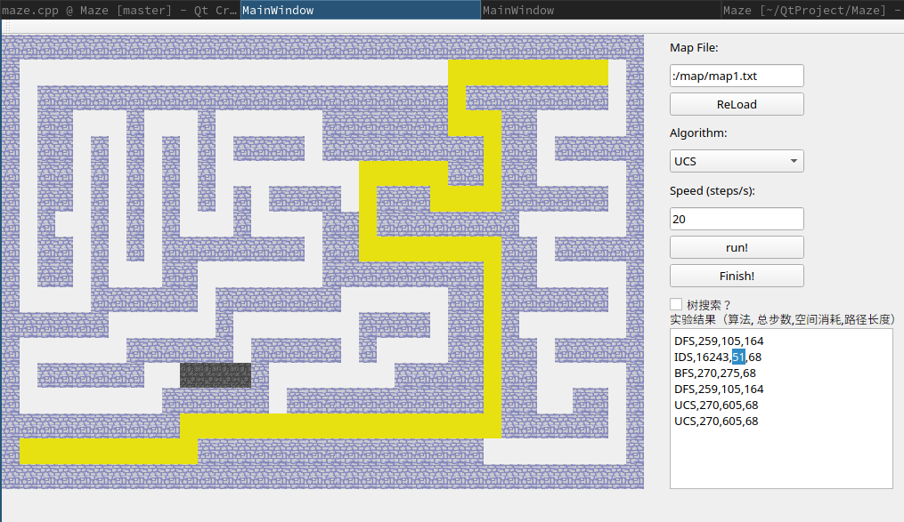
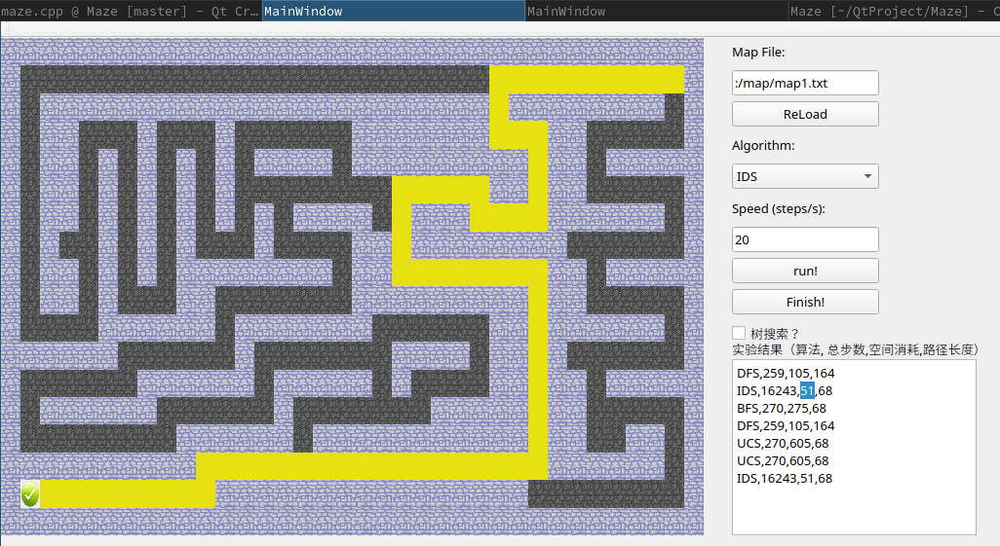

# 人工智能实验报告-无信息搜索

|  姓名  |   学号   |  班级   |
| :----: | :------: | :-----: |
| 李新锐 | 15323032 | 计科2班 |

[TOC]

## 一、算法原理

搜索是解决人工智能领域问题的一类方法，使用搜索我们能够解决行程规划、棋类博弈等问题。搜索问题可以分为无信息和搜索和有信息搜索。其中无信息搜索可以被形式化定义为一个四元组：
$$
(\{状态空间\}, 初始状态, \{行动\}, \{目标状态\})
$$
搜索的过程是，从初始状态开始，搜索算法不断采取行动导致状态在状态空间中发生转移，直到状态变为目标状态集中的一个状态，算法停止。

对于有信息搜索，还提供了启发式函数。本次实现的是无信息搜索，不考虑这一点。

我实现了以下算法

- 宽度优先搜索
- 深度优先搜索
- 一致代价搜索
- 迭代假设搜索

并同时实现了图搜索与树搜索，前者需要记录已访问节点，并不会重复访问；后者则不做该种记录。

下面分别介绍我实现的各种搜索算法的原理：

### 1. 宽度优先搜索

**原理：**

1. 维护一个边界节点队列，从初始节点开始，将子节点加入队列中
2. 再从队列头部取出一个节点$c$
3. 探索节点$c$，并从节点$c$开始重复步骤1，直到到达目标节点或队列为空（未找到目标节点）

**完备性**：具备，即便图中有环也能找到

**最优性**：若各步骤的代价不相同则不是最优的

**复杂度**

$b$: 每个节点子节点的数目的最大值，例如二叉树中是2
$d$：到达目标节点的最短路径

- 若当子节点放入时立即判断，时间复杂度：$O(b^d)$，空间复杂度：$O(b^d - b)$
- 若探索子节点时才判断子节点是不是目标状态，则时间复杂度是$O(b^{d+1})$，空间复杂度是$O(b^{d+1} - b)$

### 2. 深度优先搜索

**原理**：采从初始节点开始，选择一个子节点$c$，从$c$开始采用递归地形式，不断探索下去，直到到达目标节点结束搜索，或到达叶子节点发生回溯，再探索其他子节点。

**完备性**：不具备

**最优性**：不具备

**复杂度**

设$m$是状态空间中最长的路径

时间复杂度：$O(b^m)$
空间复杂度：$O(bm)$

###  3. 一致代价搜索

**原理：**该算法是宽度优先搜索的改进。它将搜索队列按照至今为止探索到的所有路径的总费用，由小到大排序，并总是从最小的代价的路径开始探索。当所有移动操作的代价相同时等同于宽度优先分析。

**完备性**：具备
**最优性**： 具备

**复杂度**：

设每一步权重的下界是$\epsilon$，则步数上界$d$是$C^* / \epsilon$，将这个$d$带入宽度优先搜索的复杂度公式即是一致代价搜索的复杂度。


## 4. 迭代递增搜索

**原理**：

迭代加深搜索基于的是限制深度搜索，后者是在深度优先搜索中将限制m到L，解决了无限搜索步骤的问题，但只能解决$d \le L$的问题。而迭代递增搜索不断尝试增大$d$ 的值直到搜索到目标。

**完备性**：具备

**最优性**：

当费用相同时具备。当费用不同时，可以用费用上界限制

- 仅扩展费用小于费用上界的路径
- 在每轮迭代中跟踪最小费用的未探索路径。下一轮中增大费用上界。

**复杂度：**

时间复杂度：$$(d + 1)b^0 + db + (d − 1)b^2 + ... + b^d = O(b^d)$$

空间复杂度： $ O(bd)$

## 二、伪代码

以下伪代码的目的在于展示各个算法的核心原理。额外的内容如：路径回溯、可视化等则在下一节代码展示中展示

### 1. 宽度优先搜索

```python
function bfs(maze):
    # S是起始节点
    S = findS(maze)
    # Q是边界节点队列
    Q = queue(S)
    # V用于记录到过的节点
    V = set()
    # 若队列中还有节点
    while !Q.empty():
        # 获取队首节点
        f = Q.front()
        # 将f移除队列
        Q.pop()
        # 如果f是目标节点，则算法结束
        if isEnd(maze, f):
            break
        # 遍历f的所有子节点
        for c in findChild(maze, f):
            # 如果是图搜索，要判断c是否已经访问过
            if Graph_Search and !V.contain(c):
                # 如果未访问过，则将f加入队尾，并加入访问过的集合
                Q.push_back(f)
                V.insert(f)
            # 如果是树搜，则直接加入队尾
            else if Tree_Search:
                Q.push_back(f)
```

### 2. 深度优先搜索

```python
# dfs接口函数
function dfs(maze):
    # S是起始节点
    S = findS(maze)
    # V用于记录到过的节点
    V = set()
    # 调用递归的探索函数
    explore(maze, S, V)

# 递归的探索函数，当前节点为f
function explore(maze, f, V):
    # 如果当前节点是目标节点，直接返回
    if isEnd(maze, f):
        return
    # f已探索，加入V中
   	V.insert(f)
    # 探索f的所有未探索过的子节点
    for c in findChild(maze, f):
        if(!V.contain(f)):
        	explore(maze, c,V)
```

### 3. 一致代价搜索

```python
function bfs(maze):
    # S是起始节点
    S = findS(maze)
    # H是一个最小堆，堆中元素是路径
    H = min_heap({S})
    # V用于记录到过的节点
    V = set()
    while !H.empty():
        # 获取最小费用的路径
        p = H.top()
        # 将p移除队列
        H.pop()
        # 如果路径p到达了目标节点，则算法结束
        if isEnd(maze, p.back()):
            break
        # 遍历路径末尾节点的所有子节点
        for c in findChild(maze, p.back()):
            # 如果是图搜索，要判断c是否已经访问过
            if Graph_Search and !V.contain(c):
                #如果未访问过则生产新的路径加入H, 并将c加入V
                H.push_back({p + f})
                V.insert(c)
            # 如果是树搜，则直接生产新的路径加入H
            else if Tree_Search:
                H.push_back({p + f})
```

### 4. 迭代加深搜索

```python
# ids接口函数
function dfs(maze):
    # S是起始节点
    S = findS(maze)
    # V用于记录到过的节点
    V = set()
    # 在找到目标节点前，不断增大最大搜索代价
    while cutoff:
    	explore(maze, S, V, limit++)

# 递归的探索函数，当前节点为f，相对于DFS中的版本添加了limit限制
function explore(maze, f, V, limit):
    # 如果超过深度限制，返回cutoff
    if(limit == 0): return cutoff
    # 否则继续，允许的深度减一
	limit--
    # 如果当前节点是目标节点，直接返回
    if isEnd(maze, f):
        return success
    # f已探索，加入V中
   	V.insert(f)
    # 探索f的所有未探索过的子节点
    for c in findChild(maze, f):
        if(!V.contain(f)):
            # 此处子节点不应修改父节点的V集合
            # 原因是从不同路径到达统一节点，使用的深度可能不同
        	explore(maze, c, deepcopy(V))
```

##  三、代码截图

说明:

- 代码使用C++编写

- 所有算法都有相同的接口形式:

  ```c++
  function<Result_t(const Maze& maze, const DrawF& drawF, bool checkloop)>
  ```

  `Result_t`用于返回运行结果的部分信息,包含以下项内容

  ```c++
  struct Result_t {
      // 总步数
      int viscnt = 0;
      // 是否找到目标
      bool cutoff = true;
      // 找到的路径
      list<Point> path;
      // 整个算法运行过程中最大消耗空间
      size_t space = 0;
  };
  ```

  `maze`是迷宫

  ```c++
  using Maze = vector<vector<char>>;
  ```

  `drawF`是绘图函数, 接收两个参数,分别是绘图的位置和绘制什么内容。

  ```c++
  using DrawF = function<void(const Point&, const QString&)>;
  ```

  `checkloop`若为true，执行图搜索，否则执行树搜索

### 1. 宽度优先搜索



### 2. 深度优先搜索





### 3. 一致代价搜索



### 4. 迭代加深搜索



## 四、创新点

1. 使用Qt编写了图形界面，以动态的方式展示迷宫中的“勇士”探索迷宫的过程。
2. 实现了路径回溯，从而不仅能够直到找到的路径的长度，还能知道路径本身是什么

## 五、实验结果及分析

### 一、算法性能

基于提供的迷宫地图，我测试了4个算法。测试过程中均使用图搜索。

试验中我记录了算法三个方面的数据，分别是：

- 总步数：即整个运行过程中探索的节点数，具体而言，即是基于宽搜的算法中从队列取出节点的次数，和基于深搜的算法
- 最大消耗空间：记录整个运行过程中消耗的内存空间的最大值。并不是物理的内存字节数，而是将任何数据结构中存储的一个节点作为一个单位。均包括了记录访问过的节点的V集合的大小，以及包括了基于宽搜的算法中队列中存储的元素的个数，基于深搜的算法每一层存储的待遍历子节点数目。
- 路径长度：最终找到的路径长

| 算法 | 总步数 | 最大消耗空间 | 路径长度 |
| ---- | ------ | ------------ | -------- |
| BFS  | 270    | 275          | 68       |
| DFS  | 259    | 506          | 164      |
| UCS  | 270    | 605          | 68       |
| IDS  | 16243  | 2465         | 68       |
|      |        |              |          |

### 二、分析思考

依据实验结果，有以下观察：

1. 由于本实验中迷宫每一步的路径是相同的。故除DFS算法外，其余算法均找到了最优路径
2. 由于迷宫中没有环，故所有算法均找到了一条路径
3. BFS，DFS，UCS算法找到最短路径所用的步数是差不多的。但IDS算法则使用了近60倍的时间。
4. 在理论课的分析中，IDS和DFS算法一样有着线性的空间复杂度，然而在实际实现的过程中发现，执行IDS+图搜索的过程中，其每一层储存访问过的节点信息要深复制给子节点，。原因是从不同路径到达同一节点，使用的深度可能不同，必须再次探索。因此IDS算法实际消耗要比其他算法高出一个数量级。同时，DFS由于走了一个很长的路径，其消耗的最大储存空间反而比BFS/UCS大。

可见，不同算法有不同的使用场景：

- BFS：观察算法执行的视频，可以看到BFS算法即使在接近目标时，也一直在“左顾右盼”，因此适合于到达目标的深度不大的问题。
- DFS：在到达目标的路径比较长的情况下，由于其线性的空间复杂度，可能会是唯一能够在有限的内存下解决问题的算法。但由于它一头撞到底的搜索方式，虽然可能最快找到解，但不一定找到最优解。
- UCS：适合于路径费用不一致的情况。通过调整路径费用下界，也可以达到降低时间和空间消耗的目的。
- IDS：由于上面讨论的实现上的巨大内存开销，因此适合于树搜索。同时搜索过程非常耗时，适合于对及时性要求不高，但一定要找到最优解的情况。

### 三、过程视频

[BFS.mp4](https://lixinrui000.cn/BFS.mp4)

[DFS.mp4](https://lixinrui000.cn/DFS.mp4)

[UCS.mp4](https://lixinrui000.cn/UCS.mp4)

[IDS.mp4](https://lixinrui000.cn/IDS.mp4)

点击此链接在线查看，或在代码压缩包中`视频录像`文件夹中查看

截图：

BFS结果：


DFS结果：



UCS结果：



IDS结果：




