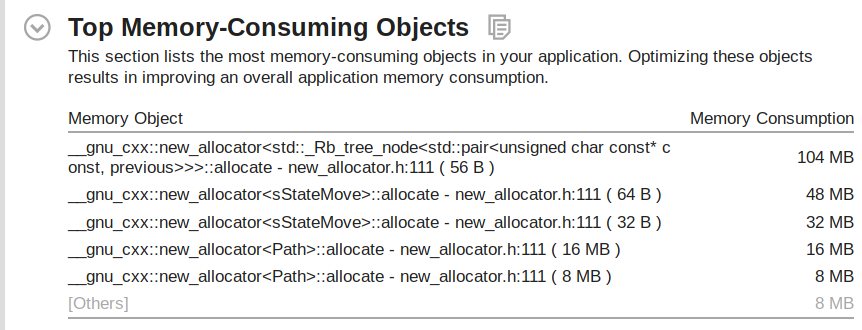

# 人工智能实验报告-启发式搜索

|  姓名  |   学号   |  班级   |
| :----: | :------: | :-----: |
| 李新锐 | 15323032 | 计科2班 |

[TOC]

## 一、算法原理

### 1. 启发式搜索

在上周的人工智能实验中，我们学习了搜索算法的原理并实现了多种搜索算法。这些算法对于上周实验里的迷宫问题是有效的，但却显得不是那么“智能”。下图是上周执行BFS算法过程中的截图，图中迷宫中的“勇士”已经很接近终点，但却不会一步到位冲向终点，而是会对包括红框中圈出的那些进行不必要的探索。

****

出现这种情况的原因在于，BFS等无信息搜索算法没有利用到和终点之间的距离信息。针对这一缺点进行改进，便有了启发式搜索这一类改进算法：该类算法利用基于直观或经验构造的启发式函数$h(n)$，它代表节点$n$到目标节点的成本的估计值。依据$h(x)$对处于可转移状态队列中的节点进行评估，再选择最优的转移方式。

本次实验要实现的启发式搜索有两种：$A^*$和$IDA^*$

### 2. $A^*$算法

$A^*$ 是基于一致代价搜索（UCS）改进的启发式搜索算法， 在UCS算法中，队列中的节点依据路径代价$g(n)$进行排序，选择$g(n)$最小的下一个状态，而$A^*$算法则是结合启发函数的估计代价值，依据
$$
f(n) = g(n) + h(n)
$$
进行排序，选择$f(n)$最小的状态。

虽然利用了启发式函数，但$A*$算法在复杂度上仍与宽搜是相同的

时间复杂度：$O(b^d)$，空间复杂度：$O(b^d - b)$

$b$: 每个节点子节点的数目的最大值

$d$：到达目标节点的最短路径

#### $h(n)$的可采纳性与一致性

$A^*$算法的最优性与$h(n)$的两种性质有关：

**可采纳性：**$\forall n  \space h(n) \le h^*(n)$ 

**一致性（三角不等式）**： 对$\forall n_1, n_2, h(n_1) \le c(n_1,n_2) +h(n_2)$ 

其中，性质二是可以推出性质一的，是更强的条件。

在满足一致性的条件下，$A^*$算法满足最优性。

在满足可采纳性的条件下， 如果不采用环检测，$A^*$算法满足最优性。

在采用环检测时：

1. 一致性仍然能保证最优性
2. 可采纳性不能保证最优性
3. 采用以下方式可以使得可采纳性+环检测得到最优解：**记住之前到达某点的路径时的路径费用，如果再次到达时路径费用更低则重新explorer该点**

####  满足可满足性的$h(n)$

在松弛问题中的最优解是原始问题中的可采纳的$h$函数

拼图问题原始的规则是：

能够把一个拼图块从A移动到B如果：

1. A，B相邻
2. B为空

可行的松弛方法：

1. 只要求A，B相邻
2. 只要求B为空
3. 无要求

若采用松弛方法1，$h$值实际上是所有错位拼图块和对应目标为止的曼哈顿距离的和

若采用松弛方法2，$h$值实际上是错位的拼图块的数量

### 3. $IDA^*$算法

 $IDA^*$算法是基于$IDS$算法的改进，$IDS$算法中，搜索的深度限制是每次以一个设置的固定增幅增加的，这样以来会有很多次不必要的搜索。而$IDA^*$算法在一个节点的$f(n)$大于深度限制时剪枝，同时返回该值。父节点取子节点中返回值的最小的值作为下一次迭代时设置的最小阈值。

在满足可采纳性时$IDA^*$算法满足最优性。

$IDA^*$算法采用的是路径检测，在一条递归的探索路径中不会重复探索路径中的祖先节点。

$IDA^*$算法的复杂度与$IDS$算法相同：时间复杂度：$O(b^d)$，空间复杂度：$O(db)$

## 二、伪代码

### 1. $A^*$算法

```python

function AStar(State S):
    # S是起始状态
    # h是启发式函数
    # H是一个最小堆，依据F(n)的值进行排序
    def CompareFn(S1, S2): 
        return S1.cost + h(S1) < S2.cost + h(S2)
    H = min_heap<CompareFn>
    # 将起始状态加入堆中
    H.insert(S)
    # V用于记录到过的节点
    V = set()
    while !H.empty():
        # 从堆中获取F(n)值最小的状态
        n = H.top()
        # 将n移除堆
        H.pop()
        # 如果n到达了目标状态，则算法结束
        if isEnd(n):
            break
        # 遍历所有可以转移到的状态
        for c in findChild(n):
            # 判断c是否已经访问过，若访问过判断再次到达时路径费用是否更低
            if  !V.contain(c) or (n.cost+1) < V[c].cost:
                #如果未访问过或再次到达时路径费用更低，并将c加入H, V
                H.insert(c)
                V.insert(c)
```

### 2. $IDA^*$算法

```python
function IDAStar(S):
    # S是起始状态
    # 初始limit设为0 
    limit = 0
    # 不断迭代搜索 
    while true:
        # 从以S为起始节点的路径开始探索
    	ret = explore(list{S},limit)
        # 若返回搜索成功或确认失败（没有从任何一个子节点开始的探索返回小于Infinity的值），结束算法
        if ret == Success || Infinity:
            break
        # 否则将返回值作为下一次迭代时设置的最小阈值
        else:
            limit = ret

# 递归的探索函数，当前路径为P
function explore(P, limit):
    # n为路径中最后一个节点
    n = P.back
    # 如果f(n)超过深度限制，返回f(n)
    f = n.cost + h(n)
    if(f > limit): return f
    # 如果到达目标节点，返回Success
    if isEnd(n):
        return Success
    # 记录子节点返回的f值的最小值
	min = Infinity
    # 从n开始探索所有当前路径P中未探索过的子节点
    for c in findChild(n):
        if(!P.contain(c)):
            # 将c加入路径中
            P.push_back(c)
            # 递归探索
        	ret = explore(P, limit)
			# 找到了目标状态
            if ret == Success:
                return Success
            # 取所有子节点返回值中最小的
            if ret < min:
                min = ret
            # 从子节点c开始没找到目标状态，将c再移除路径
            P.pop_back(c)
    return min
```

## 三、代码展示

本次实验代码使用C++编写。

### 1. 状态的表示

本次实验中，我采用元素为8bits整数，元素个数为16的数组储存一个状态，一个状态要使用128bits存储空间。这样设计是权衡了空间和时间复杂度的结果，若用64位长的数组表示一个状态，就不能直接提取其中的任意一个元素，而需要调用函数用位运算获取，会有性能上的开销。

```c++
// 用数组储存一个状态
using StateP = const uint8_t*;
// 定义一个状态：StateP P = new uint8_t[16];
```

为了将一个状态存入堆、集合等数据结构中，要自己定义比较函数， C++中这些容器均要求容器内的类型严格弱序的，即要为它实现<比较函数

```c++
// 为两个状态P1 P2之间实现 < 比较函数
struct compState{
    bool operator()(StateP P1, statePteP P2)
    {
        // 如果P1 和 P2 地址相同，直接返回false
        if(P1 == P2)
            return false;
        for(int i = 0; i < 16; ++i)
        {
            // 如果有一个元素小于就返回 <
            if(P1[i] < P2[i])
                return true;
            else if(P1[i] > P2[i])
                return false;
        }
        // P1 和 P2内容相同，返回false
        return false;
    }
};
```

### 2. 子状态的寻找

```c++
struct sStateMove
{
    // 使用智能指针管理生成的子状态，防止内存泄露
    unique_ptr<remove_pointer_t<StateP>> stateP;
    // 返回移动的方块，用于回溯路径
    uint8_t move;
};

// 寻找状态从f所有可以移动到的子状态
vector<sStateMove> sfindChild(StateP f)
{
    vector<sStateMove> ret;
    // 用于储存上下左右四个方向移动后的方块坐标
    pair<int, int> tmp[4];
    int n;
    // 从拼图的左上角到右下角遍历所有方块
    for(int i = 0; i < 16; ++i)
    {
        // 找到数字0代表的空白方块
        if(f[i] == 0)
        {
            // 算出空白方块的坐标
            int x = i % 4;
            int y = i / 4;
            n = 0;
            // 生成空白方块向上下左右移动后的坐标
            for(auto xstep = -1; xstep <= 1; xstep += 2)
                tmp[n++] = {x + xstep, y};
            for(auto ystep = -1; ystep <= 1; ystep += 2)
                tmp[n++] = {x, y + ystep};
            // 排除不合法（移动出边界外的移动方式）
            for(int j = 0; j < 4; ++j)
            {
                if(tmp[j].first < 0 || tmp[j].first > 3 ||
                   tmp[j].second < 0|| tmp[j].second > 3)
                    continue;
                // 生成子状态
                std::remove_const_t<std::remove_pointer_t<StateP>> * c = new std::remove_const_t<std::remove_pointer_t<StateP>> [16];
                memcpy(c, f, 16);
                int idx = tmp[j].first + tmp[j].second * 4;
                c[i] = f[idx];
                c[idx] = 0;
                // 加入返回值中
                ret.push_back({unique_ptr<remove_pointer_t<StateP>>(c), static_cast<uint8_t>(c[i])});
            }
        }
    }
    return ret;
}
```

### 3. 启发函数的实现

```c++
// 计算错位个数的启发函数
int Num_wrong(StateP f)
{
    int ret = 0;
    for(int i = 0; i < 16; ++i)
    {
        if(f[i] != 0 && f[i] != E[i])
            ret++;
    }
    return ret;
}

static uint8_t ax[16], ay[16];
// 计算曼哈顿距离的启发函数
inline int L1_distance(StateP f)
{
//    return 0;
    int ret = 0;
    // 遍历拼图
    for(uint8_t i = 0; i < 16; ++i)
    {
        // 获取拼图位置i上的数字n
        uint8_t n = f[i];
        // 得到数字n当前位置
        ax[n] = i % 4;
        ay[n] = i / 4;
    }
    // 计算除了空方块外各个数字和应在的位置之间的距离
    for(int n = 1; n < 16; ++n)
    {
        ret += ((abs(ax[n] - Ex[n])) + abs(ay[n] - Ey[n]));
    }
    return ret;
}
```

### 4. $A^*$算法

为了实现1. 回溯路径 2.记录到达某个状态时的费用 这两个需求，我不是简单将某个发现的状态存入set，而是定义了以下previous结构体，并用map把previous结构体和状态关联起来

```C++
// 设f为新发现的状态（邻居状态）
// 定义f的前驱结构体
// stateP: 前驱状态
// move: 从前驱状态转移到当前状态移动的拼图块(当然也可以不存，回溯时再计算)
// cost: cost指从起点到达点f的代价

struct previous
{
    StateP stateP;
    uint8_t move;
    uint8_t cost;
};
```

主函数：

```c++

Result_t AStar(StateP S)
{
	// ret用于返回找到的路径及一些统计信息
    Result_t ret;
    // gt是比较f(n)的lambda
    auto gt = [](Path& lhs, Path& rhs)
    {
        auto H1 = Inf_distance(lhs.back);
        auto H2 = Inf_distance(rhs.back);
        return lhs.cost + H1 > rhs.cost + H2;
    };
    // 实现记录路径费用的最小堆H
    auto H = priority_queue<Path, std::vector<Path>, decltype(gt)>(gt);
	// 将起始状态加入堆中
    H.push(Path{S,0});
	// vis用于记录到过的节点
    map<StateP, previous, compState> vis;
    vis[S] = {S, 0, 0};
    while(!H.empty())
    {
        // 获取费用最小的路径
        auto p = H.top();
		// 移除堆
        H.pop();
        // 获取路径的最后面的节点
        auto f = p.back;
        // 如果到达了目标状态，则算法结束
        if(isEnd(f))
        {
			// 回溯路径
            while(f != S)
            {
                ret.path.push_front(vis[f].move);
                f = vis[f].stateP;
            }
            break;
        }
        // 用于记录走了多少步
        ret.stepcnt++;
        // 从最后面的节点开始探索子节点
        for(auto& c: sfindChild(f))
        {
        	// 判断c是否已经访问过，若访问过判断再次到达时路径费用是否更低
            auto cp = vis.find(c.stateP.get());
            if(cp == vis.end() || cp->second.cost > (p.cost + 1))
            {
            	// 如果未访问过或再次到达时路径费用更低
            	// 生成新的状态
                auto np = p;
                np.back = c.stateP.release();
                np.cost++;
                // 将新的状态加入H，vis
                H.push(np);
                vis[np.back] = {p.back, c.move, np.cost};
            }
        }
    }
    // 记录总共探索了多少个状态
    ret.explored = vis.size();
    // 释放内存
    for(auto& i: vis) delete[] i.first;
    return ret;
}
```

###  5. $IDA^*$算法

```c++
/* IDA*的探索函数
   p是当前路径
   moves到达当前状态的移动过程，用于显示结果
   cost是当前路径费用
   ret用于返回其他统计信息
   limit是深度限制
   depth是层数，用于调试
*/
int dfs_worker(list<StateP>& p, list<int>& moves, int cost, Result_t& ret, int limit = -1, int depth = 0)
{
    ret.stepcnt++;
    // n为路径中最后一个节点
    StateP n = p.back();
    // 如果f(n)超过深度限制，返回f(n)
    auto f = cost + Inf_distance(n);
    if(f > limit)
        return f;
    //  如果到达目标节点，返回-1代表Success
    if(isEnd(n))
    {
   		// 用于显示移动的过程
        ret.path = moves;
        return -1;
    }
    // 记录子节点返回的f值的最小值
    int min = 1E9;
    // 从n开始探索所有当前路径P中未探索过的子节点
    for(const auto& c: sfindChild(n))
    {
    	// 查找路径中是否依据包括状态c
        if(std::find_if(p.begin(), p.end(), [&c](auto P){return compeq(P, c.stateP.get());}) == p.end())
        {
        	// 将c加入路径中
            p.push_back(c.stateP.get());
            moves.push_back(c.move);
            // 递归探索
            auto t = dfs_worker(p, moves, cost + 1, ret, limit, depth + 1);
            // 找到了目标状态返回-1代表success
            if(t == -1) return -1;
            // 取所有子节点返回值中最小的
            if(t < min) min = t;
            // 从子节点c开始没找到目标状态，将c再移除路径
            p.pop_back();
            moves.pop_back();
        }
    }
    return min;
}

/* IDA*主函数
   S是起始状态
*/
Result_t idAstar(StateP S)
{ 
	// ret用于返回找到的路径及一些统计信息
    Result_t ret;
	// 初始化limit为0，路径仅包含起点S，移动过程为空
    int limit = 0;
    list<StateP> p{S};
    list<int> moves;
	// 不断迭代搜索 
    while(true)
    {
    	// 从以S为起始节点的路径开始探索
        int t = dfs_worker(p, moves, 0, ret, limit, 0);
        // 若返回搜索成功(用-1表示)或确认失败（没有从任何一个子节点开始的探索返回小于无穷大的值），结束算法
        if(t == -1)
            break;
        else if(t == 1E9)
            return ret;
        // 否则将返回值作为下一次迭代时设置的最小阈值
        else
            limit = t;
    }

    return ret;
}
```


## 四、实验结果及分析

### 1. 实验环境

CPU： Intel I7-8700K, 单核心频率为 3.7 up to 4.7GHz

内存：32GB DDR4 3000MHz

未设置虚拟内存

操作系统：Archlinux

编译器及编译选项：g++-8.2.1 -O2

### 1. 启发函数设计


基于$A^*$算法及实验PPT提供的第二个测试样例，我测试了不同的启发函数

| $h(n)$ | 说明 |性能变化               |
| ---------- |-- | ---------------------- |
| 曼哈顿距离 |  满足$h(n) \le h^*(n)$ |耗时3.577s，内存使用196MB |
| 错位拼图数 | 满足$h(n) \le h^*(n)$|内存耗尽 |
| $h(n) = 0$ |    |  内存耗尽               |
|$h(n) = h^*(n)$ | 本次实验中不能以合理的时间验证此情况 |  |
|$h(n) \gt h^*(n)$ | 本次实验中不能以合理的时间验证此情况 | |

在本问题中，并没有可用的$h^*(n)$函数，因此如果想分析$h(n) > h^*(n)$及$h(n) > h^*(n)$时的算法的性能，就要在$A^*$算法中对每一个要探索的子节点$c$再调用一个搜索函数（如$IDA^*$）来获取$h^*(c)$。我进行了代码实现，但由于探索的节点过多，是不能在合理的时间范围内运行出来的。

就能够运行的三种启发式函数来看，不同的$h(n)$对性能的影响是巨大的。当提供$h(n) = 0$， 算法退化为BFS时，盲目地搜索耗尽了内存。而错位拼图数的放松条件过强，也没能够完成搜索。而曼哈顿距离则比较符合实际中人在玩15-拼图游戏时的推断方式，仅用3.577s，耗用196MB就完成了搜索。

### 2. $A^*$性能

基于上一节的测试结果，在接下来的试验中，我均采用的是曼哈顿距离作为启发函数

| 样例 | 时间     | 内存消耗  | 是否找到最优解 |
| ---- | -------- | --------  | ------------ |
| 1    | 618.434s | 16.6GB    | 是           |
| 2    | 3.577s   | 196MB      | 是           |
| 3    | 795.585s | 22.1GB        | 是           |
| 4    | 13.404s | 578MB | 是 |


### 3. $IDA^*$性能

| 样例 | 时间     | 内存消耗 | 是否找到最优解 |
| ---- | -------- | -------- | -------------- |
| 1    | 196.493s | 1.7MB    | 是             |
| 2    | 0.931s   | 1.6MB    | 是             |
| 3    | 394.167s | 1.5MB    | 是             |
| 4    | 7.41s    | 1.7MB    | 是             |

对比两种算法，尽管在理论时间复杂度上两者相同，但由于本实验中四个样例的实际结果的步长都只在一百以下，而$IDA^*$限制了搜索深度，避免了很多深度过深的搜索，因此搜索速度比$A^*$块一倍及以上。

在空间复杂度上，$A^*$的空间消耗极高，相比之下$IDA^*$的空间消耗几乎可以忽略。如下图，使用Intel VTune Amplifier对$A^*$运行样例2进行内存消耗分析可见，主要的内存消耗都是用于的内存消耗是用于map数据结构（`__gnu_cxx::new_allocator<std::_Rb_tree_node<std::pair<unsigned char const* const, previous>>>::allocate` ）储存访问过的节点（104MB），而队列（`__gnu_cxx::new_allocator<Path>::allocate `）中最大只用了16MB内存，这可谓是图搜索的劣势所在。




## 附录：实验原始结果数据

以下是实验过程中对PPT上4个样例采用两种算法运行得到的结果数据，其中每个测试样例之间用横线符号分割，横线中写明了算法和样例编号

每个样例的结果包括以下几行：

- 路径长度（Find solution with X moves）
- 路径
- 总探索的节点数（步数）
- 耗时
- 探索速度（步数/耗时）
- 内存消耗

```
/home/lixinrui/CLionProjects/Puzzle/cmake-build-release/Puzzle
Please enter the puzzle you want to solve: 
----------idAstar, 1---------
Find solution with 56 moves
5 12 9 10 13 5 12 13 5 2 8 6 3 1 6 3 4 11 1 4 10 5 2 8 3 10 5 15 11 5 10 2 15 11 14 9 13 15 11 14 9 13 14 10 2 6 4 2 6 3 7 4 3 7 8 12 
Steps: 861726907
Time(s): 196.493000
Speed(steps/s): 4385534
Mem: 1.732 MB
----------idAstar, 2---------
Find solution with 49 moves
6 10 9 4 14 9 4 1 10 4 1 3 2 14 9 1 3 2 5 11 8 6 4 3 2 5 13 12 14 13 12 7 11 12 7 14 13 9 5 10 6 8 12 7 10 6 7 11 15 
Steps: 4438913
Time(s): 0.931000
Speed(steps/s): 4767897
Mem: 1.632 MB
----------idAstar, 3---------
Find solution with 62 moves
7 9 2 1 9 2 5 7 2 5 1 11 8 9 5 1 6 12 10 3 4 8 11 10 12 13 3 4 8 12 13 15 14 3 4 8 12 13 15 14 7 2 1 5 10 11 13 15 14 7 3 4 8 12 15 14 11 10 9 13 14 15 
Steps: 1675410579
Time(s): 394.167000
Speed(steps/s): 4250509
Mem: 1.552 MB
----------idAstar, 4---------
Find solution with 48 moves
9 12 13 5 1 9 7 11 2 4 12 13 9 7 11 2 15 3 2 15 4 11 15 8 14 1 5 9 13 15 7 14 10 6 1 5 9 13 14 10 6 2 3 4 8 7 11 12 
Steps: 34135094
Time(s): 7.410000
Speed(steps/s): 4606625
Mem: 1.700 MB
-----------Astar, 1----------
Find solution with 56 moves
13 10 8 6 9 12 5 13 10 8 12 15 14 5 13 12 15 14 5 13 14 9 4 11 3 1 6 4 11 3 1 6 4 2 8 10 12 15 10 8 7 4 2 11 3 5 9 10 11 3 6 2 3 7 8 12 
Steps: 100020006
Time(s): 618.434000
Speed(steps/s): 161731
Total states explored: 171154946
Mem: 16.6GB
-----------Astar, 2----------
Find solution with 49 moves
6 10 9 4 14 9 4 1 10 4 1 3 2 14 9 1 3 2 13 12 14 13 5 11 8 6 4 3 2 5 12 7 11 12 7 14 13 9 5 10 6 8 12 7 10 6 7 11 15 
Steps: 1053629
Time(s): 3.577000
Speed(steps/s): 294556
Total states explored: 1947506
Mem: 196MB
-----------Astar, 3----------
Find solution with 62 moves
7 9 2 1 9 2 5 7 2 5 1 11 8 9 5 1 6 12 10 3 4 8 11 10 12 13 3 4 8 12 13 15 14 3 4 8 12 13 15 14 7 2 1 5 10 11 13 15 14 7 3 4 8 12 15 14 11 10 9 13 14 15 
Steps: 132919260
Time(s): 795.585000
Speed(steps/s): 167071
Total states explored: 228803279
Mem: 22.1G
-----------Astar, 4----------
Find solution with 48 moves
9 12 13 5 1 9 7 11 2 4 12 13 9 7 11 2 15 3 2 15 4 11 15 8 14 1 5 9 13 15 7 14 10 6 1 5 9 13 14 10 6 2 3 4 8 7 11 12 
Steps: 3212124
Time(s): 13.404000
Speed(steps/s): 239639
Total states explored: 5810452
Mem: 578MB
Process finished with exit code 0

```

