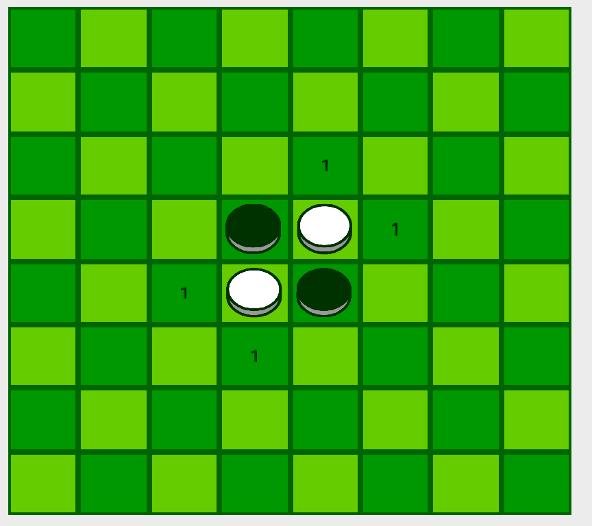

# 人工智能实验报告-博弈树搜索

|  姓名  |   学号   |  班级   |
| :----: | :------: | :-----: |
| 李新锐 | 15323032 | 计科2班 |

[TOC]

## 一、算法原理

### （1）两玩家零和博弈

本次实验中，我们研究的是两玩家零和博弈问题，该类模型可以应用于许多游戏应用中，例如五子棋，黑白棋。
该问题的形式化定义如下：

#### 定义

1. 两个玩家$A(Max)$， $B(Min)$
2. 有限的状态集S
3. 初始状态$I\in S$
4. 终止状态$T\in S$
5. 行动集合$A: S \rightarrow S$
6. 效用函数$V: T \rightarrow R$，用以评估终止状态的收益

该种问题所具有的性质如下：
#### 博弈性质

1. 零和游戏：博弈的总收益为0
2. 不涉及概率
3. 完全信息：博弈双方知道所有玩家所处状态的全部信息
4. 两名玩家轮流行动


博弈的目的在于：$A$想最大化收益，$B$想最小化收益。基于这一目的，可以设计出MinMax算法

#### 博弈树-MinMax算法

博弈树以以下形式表示出博弈问题：

1. 状态$S$表示为树的内部节点和叶子节点
2. 行动$a \in A$导致当前节点扩展出子节点
3. 调用$V$对当前节点的优劣评分


MinMax算法中，两玩家交替行动，A玩家总是选择能使得扩展的子节点$n$的评估函数值$V(n)$最大的行动$a$。B玩家则总是选择使得$V(n)$最小的行动。

#### $\alpha \beta$剪枝

为了减少不必要的探索，加快搜索的速度，本次实验中采用了$\alpha \beta$剪枝算法。

定义：

$\alpha$：极大节点的下界，最终的效用值$u(n) \ge \alpha$

$\beta$：极小节点的上界，最终的效用值$u(p) \le \beta$。

$\alpha$剪枝：剪掉极大节点$n$，若某一时刻$n$节点的$\alpha$值大于父节点$p$的$\beta$值

$\beta$剪枝：减掉极小节点n，若某一时刻n节点的$\beta$值小于父节点的$\alpha$值

结论：

如果发现某个极大节点的效用值($\alpha$值)大于等于某个极小祖先的$\beta$值 ，那么不需要探索该极大节点了

如果发现某个极小节点的效用值($\beta$值)小于等于某个极大祖先的$\alpha$值，那么不需要探索该极小节点了

#### 复杂度

不剪枝：$O(b^d)$

剪枝：最佳情况如下图：


剪枝后的：$O(b^{d/2})$

提高了一倍的搜索能力，但仍然不能解决很大的问题

### （2）黑白棋游戏

#### 规则

- 初始状态：棋盘的两条主对角线的中央分别放置两颗黑子和白子



- 黑子先行
- 在一次落子后，若在横向、竖向或对角线上有相同颜色的棋子，那么在这两个棋子之间的其他颜色棋子将会被”转化“为这种颜色。
- 一次落子必须要落在可以转化某些对手棋子的位置，其余位置不能落子。
- 当两个玩家均无法移动，或所有方格均被占据时，游戏停止
- 游戏停止时，在棋盘上棋子更多的一方获得胜利

#### 策略

1. 贪心策略：总是走能尽可能多地转化对手棋子的下法。在黑白棋游戏中，贪心策略常常是一种失败的策略，因为即使前期一方占有大量棋子，对方仍可能在后期迅速将其转化为己方棋子。
2. 稳定策略：黑白棋中，包括四角的棋子在内，无法被转化的棋子被称为稳定棋子，黑白棋的一个策略是尽可能多占据稳定棋子。容易看到，包围着四角的棋子旁边的三个棋子是非常差的落子选择，因为这将给对手下在四个角落的机会。
3. 移动性策略：在游戏的每一局，一方可落子的位置都是有限的，有更多可落子的位置对游戏取胜更有利。
4. 少即是多策略：与贪心策略相反，在游戏早期降低自己的收益。使用这种策略能够获得更好的移动性，然而有在早期就被对方消灭的危险。
5. 边界策略：一种降低对手移动性的方法是减少己方的边界节点（有空白方块相邻的节点）
6. 

## 二、伪代码

### MinMax算法

``` python
MinMax(n, Player):
    if n is Terminal:
        return V(n)
    if Player is A:
        # 返回子节点的效益值最高的
        return max([MinMax(c, B) for c in n.children])
    else:
        # 返回子节点中效益最低的
        return min([MinMax(c, A) for c in n.children])
```

### AlphaBeta剪枝

```python
# alpha, beta是父节点传过来的
AlphaBeta(n, Player, alpha, beta):
    if n is Terminal:
        return V(n)
    if Player is A:
        for c in n.children:
            # 得到某个子节点的效用值，并更新当前节点的alpha值
            alpha = max(alpha, AlphaBeta(c, B, alpha, beta))
            # 当前节点的alpha值已经大于父节点的beta值啦，当前节点已经不会被选啦
            if beta <= alpha:
                # 剪枝
                break
        return alpha
    else:
        for c in n.children:
            beta = min(beta, AlphaBeta(c, A, alpha, beta))
        	if beta <= alpha:
                break
        return beta
# 第一次调用方法：
AlphaBeta(root, player, -inf, +inf)
```

## 三、代码截图

## 四、实验创新

